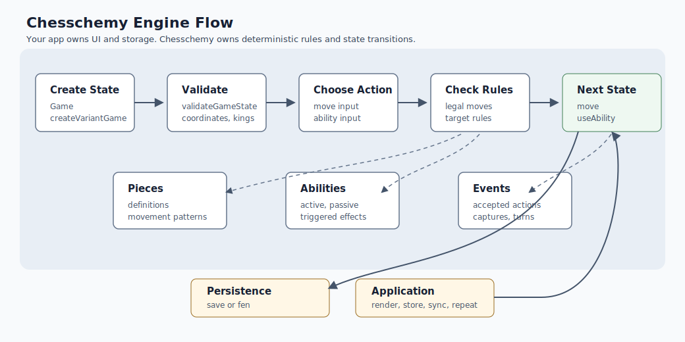

# Architecture

Chesschemy is organized around deterministic engine modules:

- `core`: shared state, coordinates, errors, and creation helpers.
- `rules`: ruleset contracts and standard chess rule validation.
- `pieces`: piece definitions and registries.
- `movement`: movement generation contracts.
- `queries`: UI-friendly board and move lookup helpers.
- `abilities`: active, passive, and triggered ability contracts.
- `effects`: state transition primitives used by abilities and rules.
- `events`: typed engine event records.
- `validation`: fail-fast state validation.
- `serialization`: JSON-friendly versioned game state persistence.
- `presets`: ready-to-use game setups.

The standard chess base currently supports legal move generation, castling, en
passant, promotion, checkmate/stalemate outcomes, public move execution, and
board query helpers.

## Engine Flow



The public API works with immutable `GameState` snapshots. Application code
submits a move or ability input, Chesschemy validates it against the current
rules and board state, applies a deterministic state transition, resolves
triggered abilities, updates terminal status, and returns the next snapshot.

```txt
Game/createVariantGame
  -> validateGameState
  -> application chooses move or ability
  -> validate/validateAbility
  -> move/useAbility
  -> events and triggered abilities
  -> result and save/fen
```

## Module Boundaries

`core` owns the shared state model, coordinates, creation helpers, and public
errors. Code in other modules should accept and return `GameState` instead of
owning a separate state shape.

`rules` owns legal move generation, check detection, game outcome checks, and
move execution. Standard chess details such as castling, en passant, promotion,
and insufficient material live here.

`pieces` and `movement` define reusable piece behavior. Built-in standard pieces
are always available by definition id; custom definitions are attached to
variant games through `pieceDefinitions`.

`abilities`, `effects`, `events`, and `statuses` form the variant-extension
layer. Active abilities are called directly, passive abilities answer rules
questions such as capture permission, triggered abilities react to engine
events, and effects perform focused state transitions.

`queries` contains UI-friendly lookups so consumers do not need to scan the
piece array for common board questions.

`serialization` has two tracks: versioned JSON-friendly state snapshots for
engine persistence, and FEN import/export for standard chess positions.

## Determinism

Engine functions should produce the same result for the same input state and
input action. Custom callbacks such as `canActivate`, `shouldTrigger`,
`canCapture`, and target validators should avoid randomness, wall-clock reads,
network calls, and mutation of external objects.

## Compatibility

Package consumers should import from `chesschemy` or one of the documented
subpath exports. Files that are not exported by `package.json` are internal, even
when TypeScript source names are visible in the repository.

Feature implementations should keep public contracts stable and grow tests with
the risk of the behavior being added. See [Advanced API](advanced-api.md) for
the supported surface.
